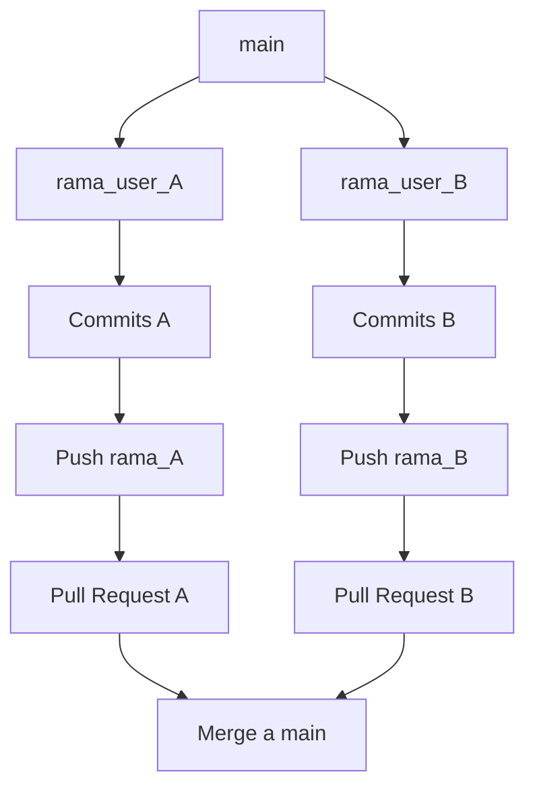
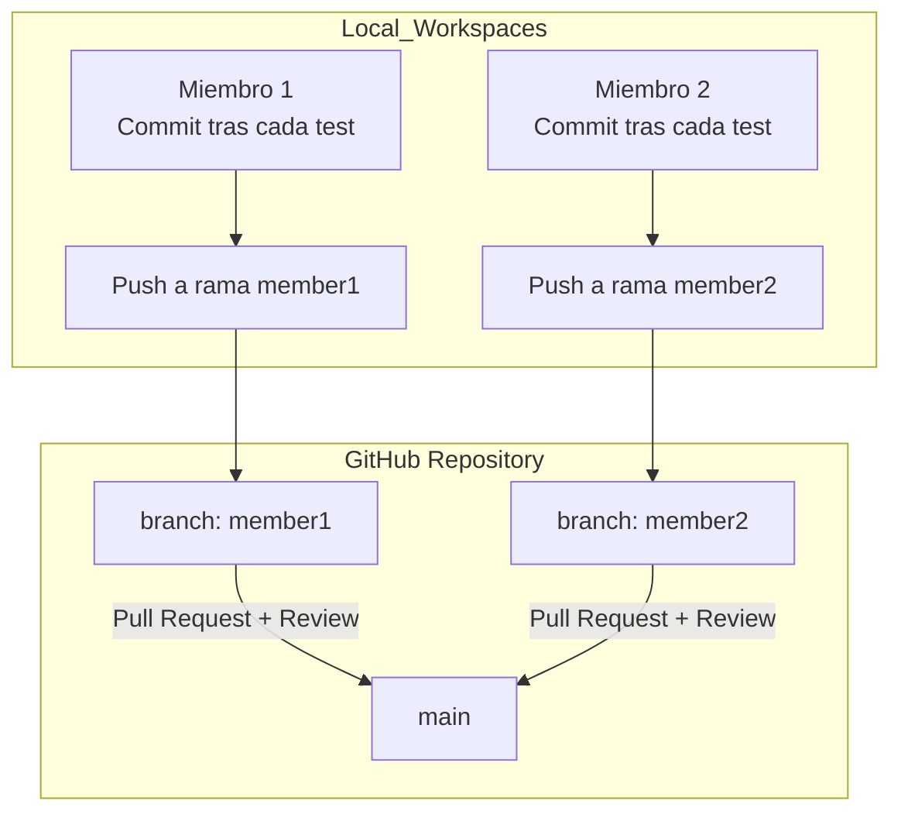

# Práctica 3  
## Técnicas de caja blanca para la generación de casos de prueba  

**Curso 2025/2026 – Calidad del Software**

---

## Objetivos

- Dibujar el **grafo de flujo** y calcular la **complejidad ciclomática** de métodos seleccionados de la clase `ListaCursos`.  
- Generar **casos de prueba aplicando la técnica de caminos básicos** de caja blanca.
- Generar **casos de prueba aplicando la técnica de cubrimiento de condicionales**.
- Implementar los casos de prueba en **JUnit 5**.  
- Detectar **errores** en los métodos mediante pruebas unitarias.   

---

## Entorno de trabajo

- **Eclipse IDE 2025-06 (4.36.0)**  
  - Soporte integrado para **JUnit 5**, **Git** y **JDK >= 17**.  
  - Incluye el plugin **EclEmma Java Code Coverage 3.1.10**.  

### Nota importante
Si se usa el ordenador personal:  
- Verificar que está instalado **JDK 17 o superior**.  
- El proyecto Maven ya incluye dependencias de **JUnit 5** y **Hamcrest**.  
- Si no aparece *Coverage As >> JUnit Test*, instalar EclEmma desde:  
  - `Help > Eclipse Marketplace... > Buscar "EclEmma"`  

---

## Contexto

La plataforma **Formandera.com** organiza sus cursos por **temáticas**.  

La clase `ListaCursos` mantiene una **lista de listas** en la que:  
- Cada sublista corresponde a una temática.  
- Cada curso se representa con la clase `Curso` (atributos: nombre, temática, nivel y valoración).  

La clase `ListaCursos` dispone de los siguientes métodos a analizar y probar:  

- `buscarCursosPorNivel(String tematica, int nivelMinimo)`  
- `cursosPendientesPorTematica(List<Curso> realizados, String tematica)`  
- `buscarCursoMejorValorado(String tematica, int nivel)`  
- `contarCursosPorNivel(String tematica, int nivelMinimo)`   

---

---
## Forma de trabajo

Se creará un repositorio de **GitHub** con el nombre `CalSo2526_P3-grupoXX`, donde XX representará el número de grupo.

Cada miembro del grupo trabajará sobre su propia rama del repositorio de trabajo del grupo. 




En función del análisis inicial del código el grupo de trabajo se repartirá el código de análisis y se procederá a la elaboración de los grafos, identificación de la complejidad ciclomática, la identificción de caminos básicos, la propuesta de casos de prueba, tanto para la estrategia de caminos básicos como de cobertura de condicionales, y su respectiva documentación que se incorporará en un fichero `.md`. 

Cada participante, realizará un commit a su repositorio local cada vez que incorpore un artefacto nuevo a la práctica (gráfico, teblas de diseño, código de casos de prueba...) y al concluir cada sesión de trabajo realizarán un push a su rama. Cuando ambos miembros concluiyan con la resolución de todo el trabajo repartido se procederá a establecer los `pull request` necesarios para unificar todos las acciones en la rama `main` donde se configurará la entrega final.

---

## Ejercicios propuestos

1. **Dibujar el grafo de flujo** de cada método.
  - En la documentación usar un subapartado para cada uno de los métodos. Cada participante en su rama y al finalizar el trabajo en la rama `main`. 
2. **Calcular la complejidad ciclomática** de cada método. 
  - Se incorporará a su respectivo apartado. Cada participante en su rama y al finalizar el trabajo en la rama `main`. 
3. **Identificar caminos básicos** y diseñar los casos de prueba correspondientes.  
   - Cada miembro del grupo deberá incorporar en **su rama personal** en el archivo `README.md` y para el subapartado de cada método las tablas de casos de prueba.   
   - El formato de la tabla será:  

```markdown
| Camino básico | Nombre del caso                       | Entrada / Estado                                              | Valor esperado                                                             |
|---------------|---------------------------------------|---------------------------------------------------------------|----------------------------------------------------------------------------|
| 1 → 2 → 4 → 6 | test_given_.... | Descripción del estado inicial de caso de prueba y de los parámetros del método   | Descripción de los asserts a comprobar en función a la especificación o de la excepción que se debe capturar   |
|
```
4. **Implementar los casos de prueba** en `ListaCursosTest.java` usando JUnit 5.
  - Cada miembro del grupo deberá incorporar los casos de prueba en **su rama personal** y con posterioridad deberán quedar unificados en la rama principal. 
5. Documentar en el `README.md` de cada rama los **errores detectados** en los métodos.  
6. Añadir, si fuera necesario el dieño (usando una tabla parecida al ejercicio 3) e implementación de los casos de prueba mediante la técnica de **cobertura de condicionales** para el método `cursosPendientesPorTematica`, comprobando la vaidez con EclEmma, y añadir al `README.md` de la rama `main` un resumen con la documentación.  

---

## Previo

- Crear un repositorio privado en **GitHub** con el nombre `CalSo2526_P3-grupoXX`.  
- Crear un **README.md** inicial con nombre, apellidos y correo UM de cada miembro.  
- Crear ramas personales siguiendo el esquema: *inicialesNombreApellidos_P3*.  



---

## Entregables

- En la tarea del Aula Virtual: enlace al repositorio GitHub que contenga:  
  - Proyecto Maven completo. 
  - Al inicio del fichero `README.md` pararecerá el nombre y correo electrónico de todos los miembros del equipo de trabajo. 
  - Documentación (en `README.md`) con grafos de flujo, complejidad ciclomática, diseño de casos de prueba usando la técnica de caminos básicos y cobertura de condicionales del método indicado en los ejercicios, implementación de los casos de prueba. Cada miembro realizará su trabajo en su rama y se unirá al finalizar todo el trabajo en la rama `main`.    
  - En `README.md` documentación de errores y cobertura.  

**Fecha de entrega:** 10/11/2025  

---

## Evaluación

- **Diagramas de flujo y complejidad ciclomática – 3.0 puntos**  
- **Casos de prueba de `ListaCursos` – 3.0 puntos**   
- **Documentación en README.md – 2.0 punto**  
- **Trabajo en ramas y PR – 1.0 punto**  
- **Cobertura con EclEmma – 1.0 punto**  

Total: **10 puntos**
